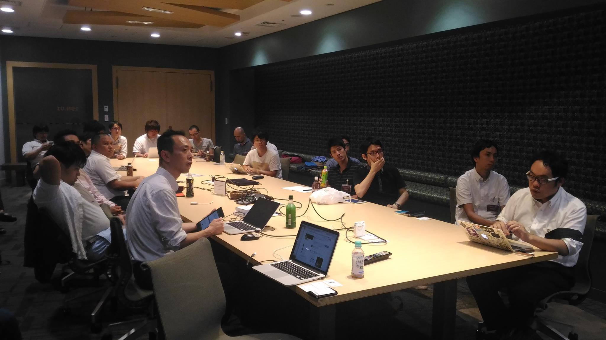
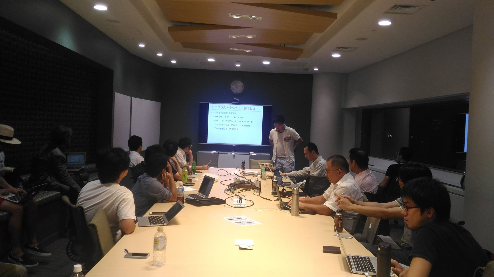

## 第2回勉強会

[イベントページ](http://jawsug-bigdata.connpass.com/event/39320/)

### 様子

 

### 01.EmbulkとDigdagで作るRedshiftデータマート

川崎　照夫

クラスメソッド株式会社 データインテグレーション部

概要：
TreasureDataさんが開発されているバルクデータローダのEmbulkとワークフローエンジンのDigdag。
この２つを組み合わせて、Redshift上にデータマートを作成してみます。

[発表資料](https://github.com/bdjaws/workshop/raw/master/20160926/01.classmethod.pdf)

### 02.データ活用のための権限管理

星　北斗

クックパッド株式会社 インフラストラクチャー部

概要：
せっかく蓄積したデータもアクセスできなければ意味がありません。
利用者が安心してデータを使うためにも、データベースのアクセス権限管理は非常に重要です。
実際の環境で使われている権限管理やオペレーションについて紹介します。

[発表資料](https://github.com/bdjaws/workshop/raw/master/20160926/02.cookpad.pdf)

