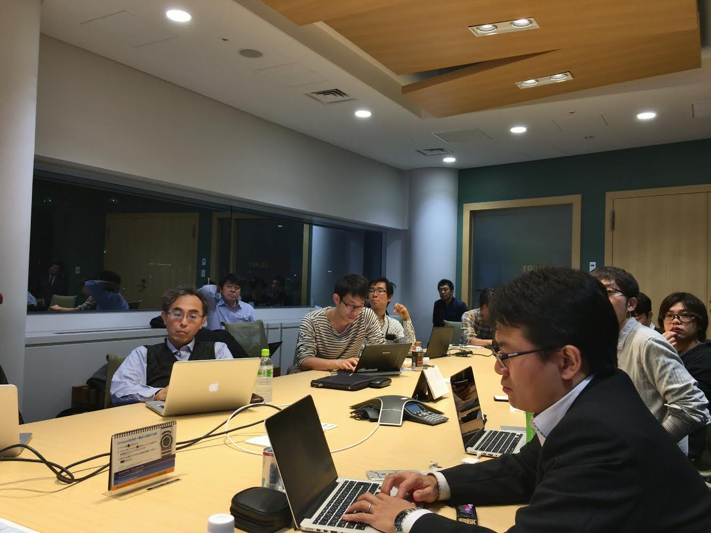

## 第3回勉強会

[イベントページ](https://jawsug-bigdata.connpass.com/event/43014/)

### 様子

### 01.Apache Nifi 1.0を使ってみた

遠山 敏章

FAST RETAILING 業務革新推進 サイトリライアビリティエンジニアリング

概要：
今流行のデータフローオーケストレーションツールであるApache Nifiを使ってみました！ 
また、Hadoop Summit Tokyoで、nifiワークショップに参加するので、その報告とあわせて紹介させて頂こうかと思います。

[発表資料](https://github.com/bdjaws/workshop/raw/master/20161118/01.fastretailing.pdf)

### 02.Kinesis Analytics使ってみた

高田　雅人

NTTドコモ サービスイノベーション部　ビッグデータ担当

概要：
Kinesisシリーズの新サービスであるKinesis Analyticsを使ってみたので、 
Kinesis Streamsとの連携方法・使えそうなところ・注意点等を紹介します。

[発表資料](https://github.com/bdjaws/workshop/raw/master/20161118/02.JAWS_BD_NTTDOCOMO.pdf)

### 03.AWSビッグデータ関連サービス最新アップデート

内海 英一郎

アマゾンウェブサービスジャパン株式会社 ソリューションアーキテクト

概要：
ビッグデータ関連サービスの最新情報アップデート

[発表資料](https://github.com/bdjaws/workshop/raw/master/20161118/03.aws_update_big_data.pdf)

