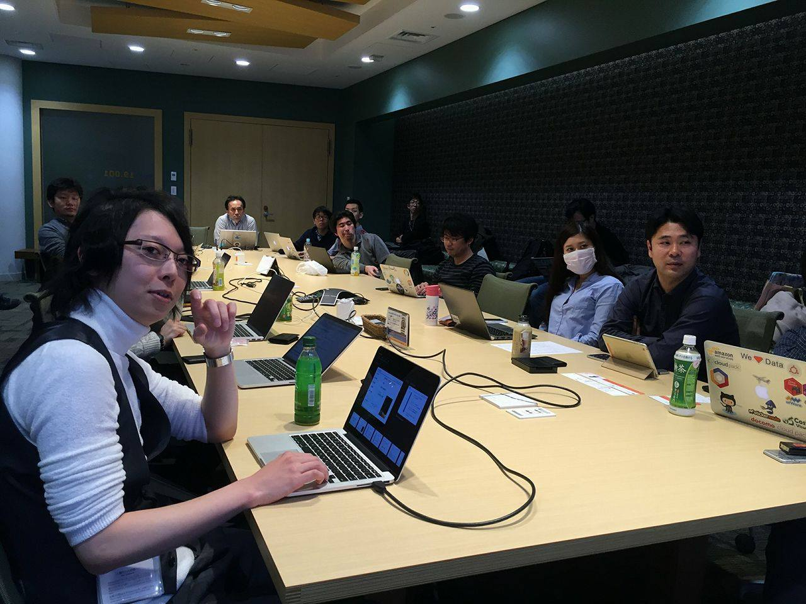

## 第4回勉強会

[イベントページ](https://jawsug-bigdata.connpass.com/event/45838/)

### 様子

### 01.基幹業務もHadoop(EMR)で!!

須田 桂伍

Future Architect Tecnology Innovation Group

概要：
Hadoop/Spark Conference Japan 2016」で発表した「基幹業務もHadoopで!! 〜ローソンにおける店舗発注業務へのHadoop + Hive導入と、 その取り組みについて〜」のその後と題しまして、
EMR(時々MySQL, Aurora)のチューニング対応を中心にお話しようかと思います。

[発表資料](https://github.com/bdjaws/workshop/raw/master/20161212/01.futurearchitect.pdf)

### 02.EMRを使ってEmbulkをスケールさせる

橋立 友宏

Repro株式会社 CTO

概要：
EMR上でEmbulkを動かすためのハマり所や、日々のバッチ処理の中にどうやって組み込んでいるのかについて

[発表資料](http://joker1007.github.io/slides/embulk_emr/slides/#/)

### 03.EMRでスポットインスタンス自動入札

荻原 啓介

株式会社リクルートテクノロジーズ ビッグデータ部

概要：
EMRの計算ノードにスポットインスタンスを使うことにより、利用料を削減する仕組みについて紹介します。 スポットインスタンスの入札金額を自動的に計算する部分が肝です

[発表資料](https://github.com/bdjaws/workshop/raw/master/20161212/03.SpotInstance.Jaws.pptx)
