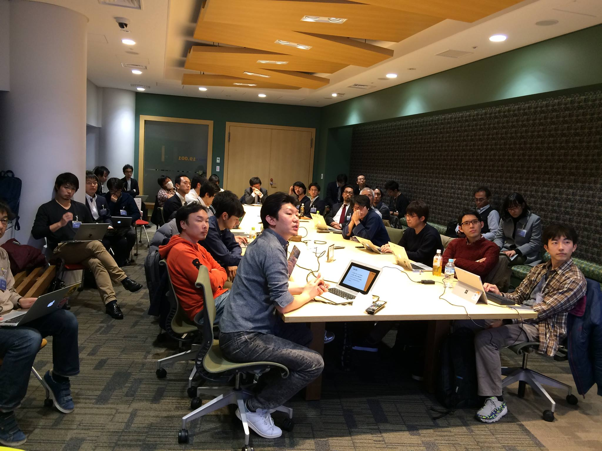

## 第4回勉強会

[イベントページ](https://jawsug-bigdata.connpass.com/event/48505/)

### 様子

### 01.AWS Athenaを使ってみた！

李 晟圭(イ・ソンギュ)

Retty株式会社

概要：
athenaの簡単な紹介と弊社での使い方、そして思ったことを発表します

[発表資料](http://www.slideshare.net/sunggyurhie/aws-athena-71663594)

### 02.AWS Athenaを使って30TBのWeb行動ログ集計を試みた

渡部 徹太郎

株式会社リクルートテクノロジーズ ビッグデータ部

概要：
S3に昔から溜めていた弊社のWeb行動ログ(30TB)をAWS Athenaを使って集計を試みました。それを話します。

[発表資料](http://www.slideshare.net/tetsutarowatanabe/aws-athena-30tbweb)

### 03.re:Invent2016 Deep Dive:Amazon EMR Best Practices & Design Patterns (BDM401) in Japanese

金平 晃尚

フリーランス

概要：
re:Invent2016のセッションBDM401の内容を日本語で説明します。

[発表資料](https://github.com/bdjaws/workshop/raw/master/20170201/03.BDM401_japanese.md)
