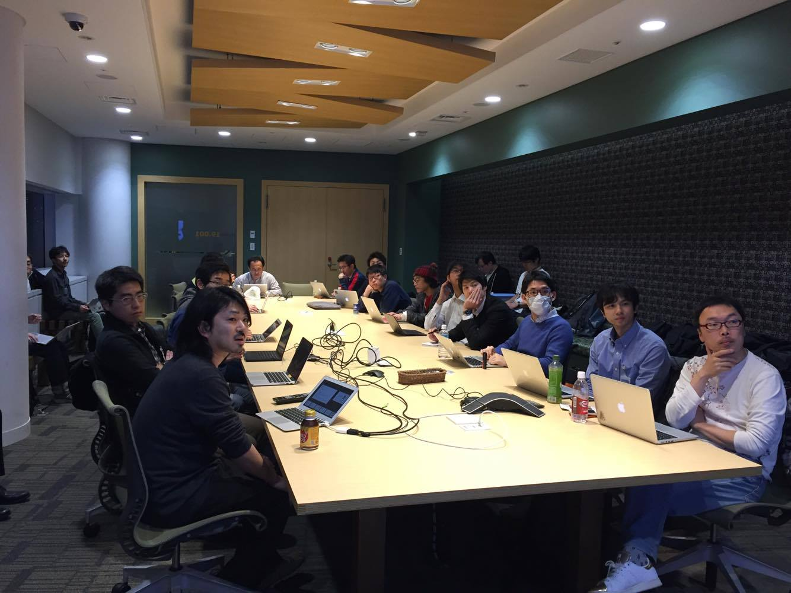

## 第6回勉強会

[イベントページ](https://jawsug-bigdata.connpass.com/event/52590/)

### 様子                                                                                                                                                    
                                                                                                                                                            

### 01.GunosyでのKinesisAnalytics利用について

小出 幸典

株式会社Gunosy 開発本部

概要：
GunosyでのKinesisAnalytics利用について、どういったところに利用しているか、どういった構成で利用しているかについて

[発表資料](https://speakerdeck.com/koid/bigdata-jaws-6-kinesis-analytics)

### 02.Kinesis Analyticsの適用できない用途とKinesis Firehoseの苦労話

木村 宗太郎

株式会社ドワンゴ

概要：
Kinesisファミリーを使用してAWS上のログのリアルタイム収集を行いました。 そこからわかったAnalyticsの隠れた制約とFirehoseの使いにくい点と対処について共有します。

[発表資料](http://niconare.nicovideo.jp/watch/kn2399)

### 03.ストリーミングデータのアドホック解析エンジンの比較

佐伯 嘉康

株式会社リクルートテクノロジーズ ビッグデータ部

概要：
Kinesis Analyticsなど、ストリーミングデータを対象にSQLなどでアドホックなデータ解析をするためのシステムが増えてきました。本発表では、そのようなシステムをいくつか取り上げ、機能面・性能面での比較を行った結果を共有します。

[発表資料](https://www.slideshare.net/laclefyoshi/ss-74398007)
