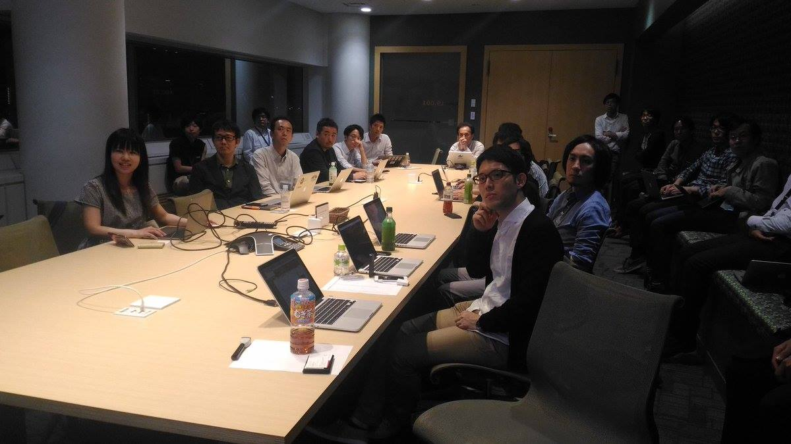

## 第7回勉強会

[イベントページ](https://jawsug-bigdata.connpass.com/event/56131/)

### 様子

### 01.Redshiftまでの大規模データフロー制御

鈴木 浩之

NTTドコモ サービスイノベーション部 ビッグデータ担当

概要：
ビッグデータ分析を行うための前処理（ETL)はツールも方法も様々。Redshiftをメインとしたドコモのビッグデータ分析基盤におけるデータ加工などのフロー制御の概要と苦労話を紹介

[発表資料](https://github.com/bdjaws/workshop/raw/master/20170518/JAW_BD_7_NTTDOCOMO.pdf)

### 02.カラムナフォーマットのきほん

林田 千瑛

Retty.Inc

概要：
EMRやAthena等のビッグデータプロダクトを利用する際の定石の一つとして、「カラムナストレージを使う」という事が挙げられます。しかしなぜカラムナストレージを使うべきなのか、その特徴について、お話します。

[発表資料](https://speakerdeck.com/chie8842/karamunahuomatutofalsekihon-2)

### 03.Redshift Spectrumを使ってみた話

河野 愛樹

株式会社リクルートテクノロジーズ ビッグデータ部

概要：
先日発表されたばかりのRedshift Spectrum。一足先に利用してみた話をしたいと思います。

[発表資料](https://www.slideshare.net/YoshikiKouno/redshift-spectrum-76121332)
