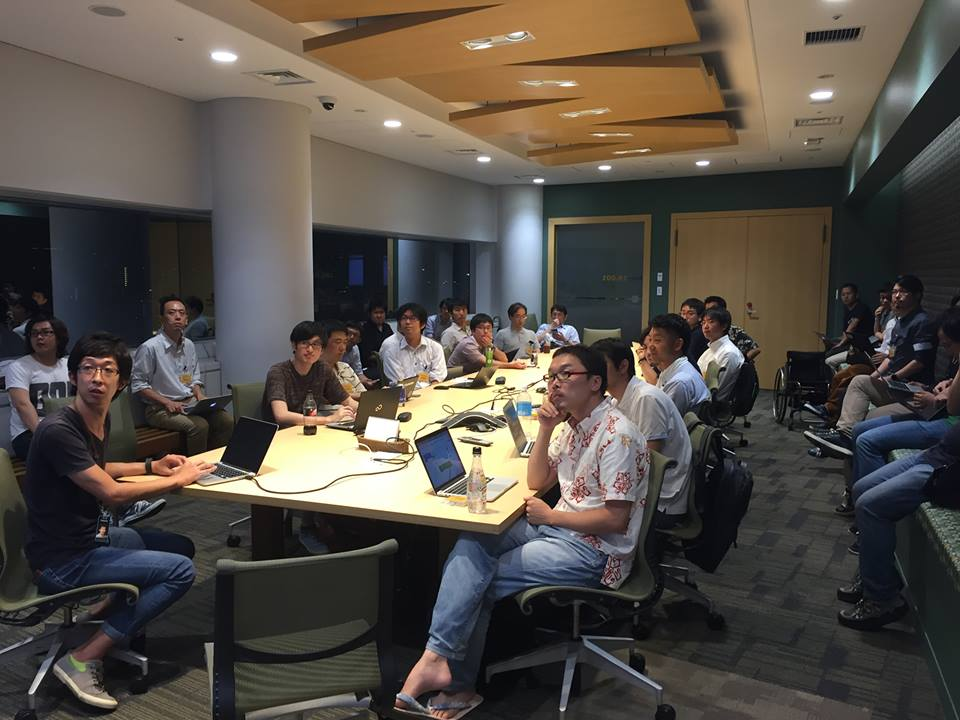

## 第8回勉強会

[イベントページ](https://jawsug-bigdata.connpass.com/event/62177/)

### 様子

### 01.Amazon QuickSightを使ってみた！

株式会社ナレッジコミュニケーション 大柳友洋さん

概要：
QuickSightの概要、使ってみた感想を紹介します。主要BIツールとの比較も行ってみます。
・QuickSightでどんなデータソースとつないで、どんな風に分析できるか
・PowerBI、Tableau、QuickView、google data studioと、機能、料金面で比較

[発表資料](https://www.slideshare.net/knowcom/amazon-quicksight-bigdatajaws-8)

### 02.Redshift運用Tips

株式会社リクルートライフスタイル　山田雄さん
NTTデータ　堤崇行さん

概要：
弊社ではRedshiftをマルチクラスタで運用しています。なぜマルチクラスタにしたのか、マルチクラスタにする際の注意点や、Cloudwatchで見られないメトリクスを見るための負荷監視方法について紹介します。

[発表資料](https://github.com/bdjaws/workshop/blob/master/20170809/redshift_ops_tips.pptx)

### 03.AWS Summit Tokyo 2017 まとめ

アマゾンウェブサービスジャパン株式会社 ソリューションアーキテクト 志村誠さん

概要：
2017/5/30-6/2 にかけて開催された AWS Summit Tokyo 2017 について全体的なトレンドやさまざまな取り組み，またビッグデータに関するものを中心とした注目セッションについてのまとめをご紹介します．

[発表資料](https://github.com/bdjaws/workshop/blob/master/20170809/20170809_aws_summit_tokyo_summary.pdf)
