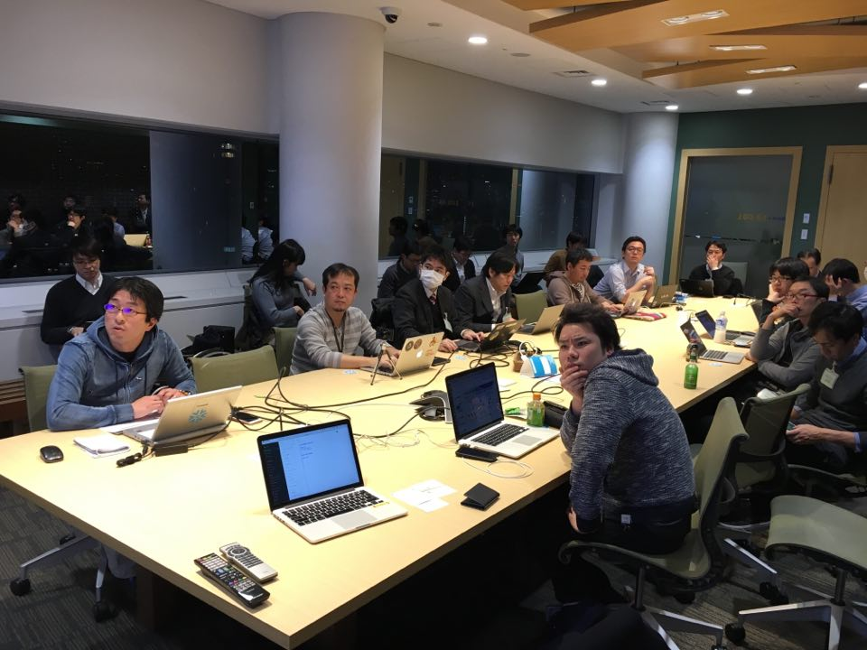

## 第11回勉強会

[イベントページ](https://jawsug-bigdata.connpass.com/event/77463/)

### 様子

### 01.re:Invent2017でプラチナスポンサーをしてたSnowflake(クラウドネイティブDWH)って何がいいの？

本橋 峰明さん

概要：
GartnerやForresterのレポートで何度もみたので検証してみました。クエリを高速化するためのアーキテクチャやユニークな機能、Redshift/BigQueryとの違い、実際に使っていく中で見えてきた製品の設計思想(妄想含む)についても紹介したいと思います。

[発表資料](https://www.slideshare.net/mmotohas/snowflake-architecture-and-performance-87346806)

[補足資料](https://github.com/bdjaws/workshop/raw/master/20180206/Snowflake補足資料.txt)

### 02.Cloudera on AWSとAmazonEMRを両方本番運用し３つの観点から比較してみる

株式会社CyberZ 茂木高宏さん

概要：
Cloudera on AWSとして、Cloudera社の代表的ツールClouderaDirector/(ClouderaAltus)と、AmazonEMRの特徴を紹介します。Cloudera on AWS/AmazonEMR両方を本番環境で運用し、そこでのアーキテクチャ/エコシステム/運用管理/インフラストラクチャ/性能/課金体系等、様々な観点から比較します。

[発表資料](https://www.slideshare.net/tkmoteki/dljawsbigdata11cloudera-on-aws-amazon-emr-3)

### 03.ビッグデータ関連の re:Invent（前後の）アップデート紹介

アマゾンWebサービスジャパン株式会社　志村 誠さん

概要：
昨年 11 月末から 12 月頭にかけて、re:Invent でさまざまなサービスが発表されました。またその前後にも多くのサービスアップデートがありました。このセッションでは，ビッグデータ領域に関するこれらのアップデートをまとめてご紹介します。

[発表資料](https://github.com/bdjaws/workshop/raw/master/20180206/20180206_bigdata_jaws.pdf)

### 備考
予定されていた野上 恭平さんの「はじめてのSnowball」は、都合により延期となりました。次回以降をご期待ください。

