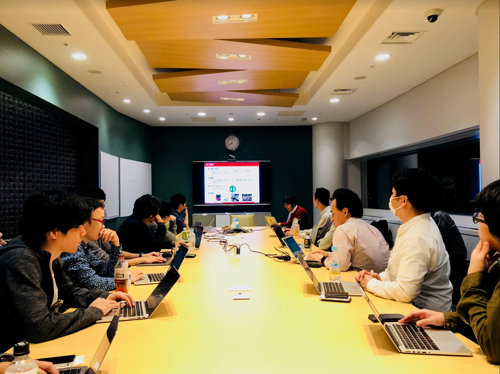

## 第12回勉強会

$イベントページ](https://jawsug-bigdata.connpass.com/event/83057/)

### 様子

### 01.リブセンスのデータ分析基盤を支えるRedshiftとAirflow

株式会社リブセンス 吉武 正史さん

概要：
弊社ではデータ分析基盤をAWS上に構築しており、その中心となるのがDWHとして活用しているRedshiftと、そのデータのETL/ELT処理を司るApache Airflowです。本発表では弊社のAirflowの活用事例をご紹介します。

[発表資料](https://speakerdeck.com/livesense/rihusensufalsetetafen-xi-ji-pan-wozhi-eruredshifttoairflow)

### あなたの知らないS3Selectの世界

株式会社リクルートライフスタイル 山田 雄さん

概要：
プレビュー中のS3Select、何ができるのか、使用してみた感想を元にお話しします。

[発表資料](https://github.com/bdjaws/workshop/raw/master/20180406/20180406_bigdata_jaws_02.pdf)

### 03. Strataで盛り上がっていたデータ処理系OSS

株式会社NTTドコモ 原野 将大さん

概要：
strata data conference 2018の模様と現地のセッションで盛り上がっていたOSSツールの中から、kafka(KSQL)とBigDLについてAWSサービスと比べながら簡単に紹介します。

[発表資料](https://github.com/bdjaws/workshop/raw/master/20180406/)

### 04. ワークフローエンジンよもやま噺

株式会社リクルートテクノロジーズ 北沢 匠さん

概要：
JP1、AirFlow、digdag、Amazon Step Functionなど数多く存在するワークフローエンジン。それぞれどんな機能を持っていて、AWS上での使い分けはどうすれば良いのか？概要をまとめてご紹介します。

[発表資料](https://github.com/bdjaws/workshop/raw/master/20180406/20180406_bigdata_jaws_04.pdf)

### 備考

