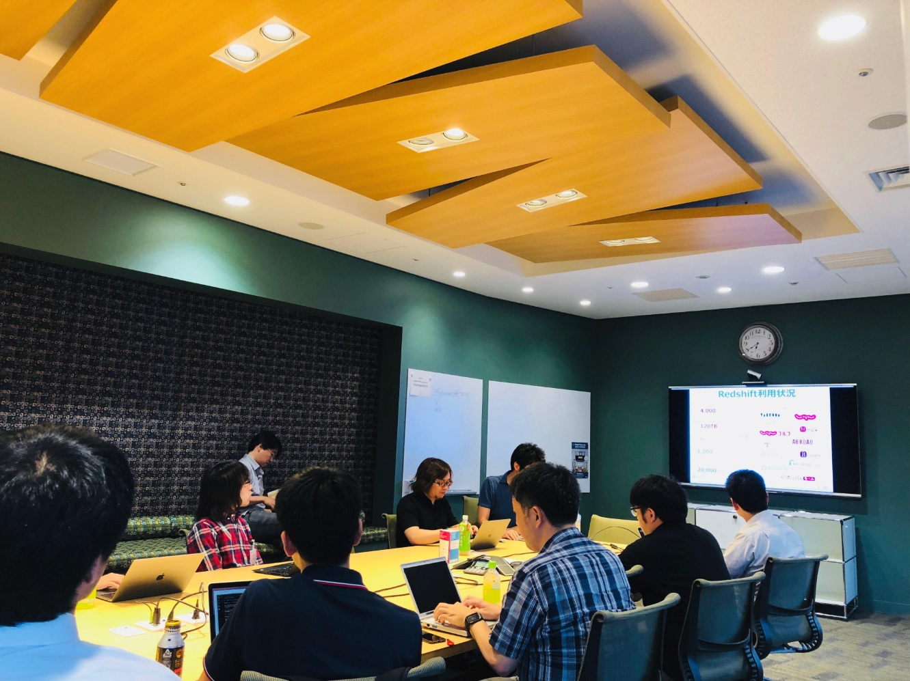

## 第13回勉強会

[イベントページ](https://jawsug-bigdata.connpass.com/event/90601/)

### 様子

### 既存Redshift/ETLからSpectrum/Glueへの移行を徹底解明！

株式会社リクルートライフスタイル 秋本大樹さん

概要：
弊社ではRedshiftの負荷増大に伴いRedshiftSpectrumの導入を行っております。また既存のETL処理の置き換えも実施しており、Glue/Lambda/Batchなど種々のAWSサービスを使用しています。本発表では、弊社の分析基盤の構成とその移行案、さらに移行に関して直面した課題などをより技術的な視点からご紹介いたします。

[発表資料](https://www.slideshare.net/RecruitLifestyle/redshiftetlspectrumglue)

### 思ったより大変だったDMSによるデータレプリケーションの話

株式会社 オープンストリーム 奥田博康さん

概要：
とあるデジタルマーケティング会社のAWSインフラを担当しています。その中で、オンプレ環境下のオラクルからAuroraへの継続的データレプリケーションをDMSで行ったのですが…。

[発表資料]()

### HBase on EC2

株式会社サイバーエージェント 佐藤栄一さん

概要：
弊社ではHBaseを多く活用しており、AWS上で稼働するある広告配信システムでも各種の配信制御のためのバックエンドDBとして、EC2上でHBaseを運用しています。その構成やトラブル事例について紹介いたします。

[発表資料](https://www.slideshare.net/EiichiSato/hbase-on-ec2)

### グラフデータベースNeptune使ってみた（Janusgraphとの比較）

株式会社リクルートテクノロジーズ 佐伯 嘉康さん

概要：
Neptuneと、既に本番利用しているJanusgraphを、機能・性能面で比較してみました。

[発表資料](https://www.slideshare.net/laclefyoshi/neptune-103294851)

### 備考

